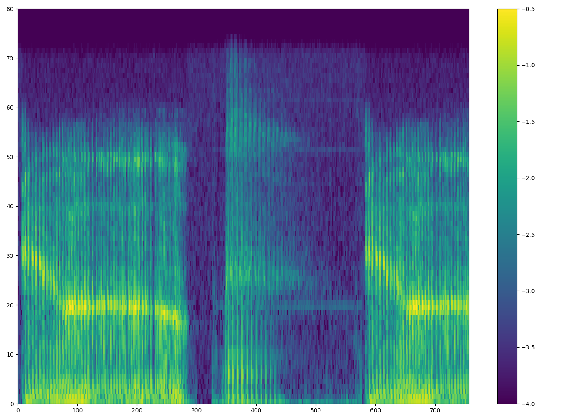
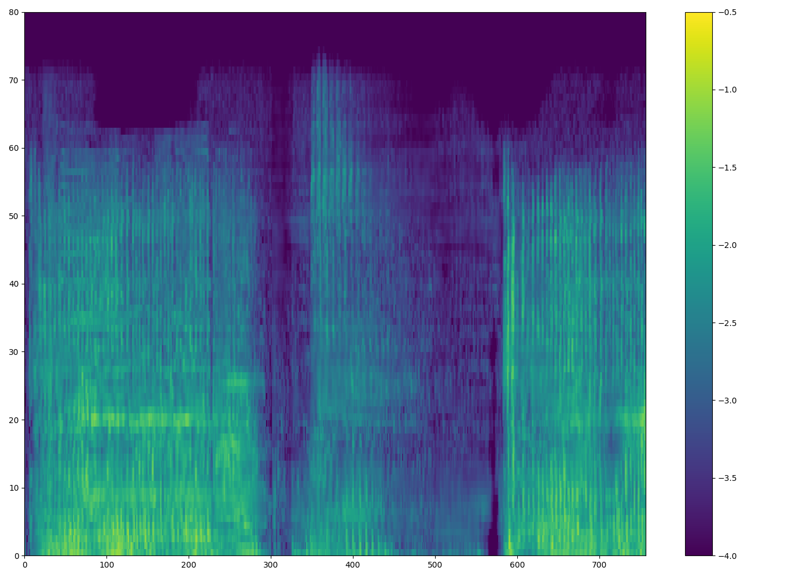
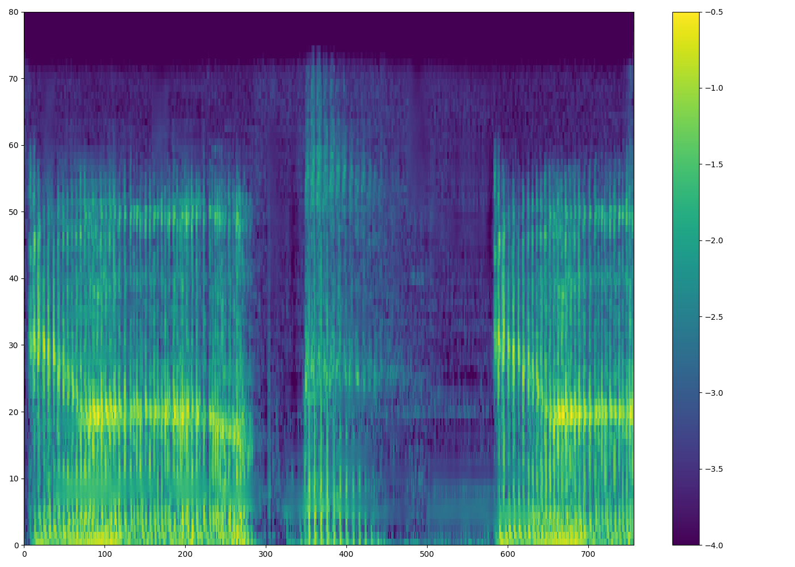
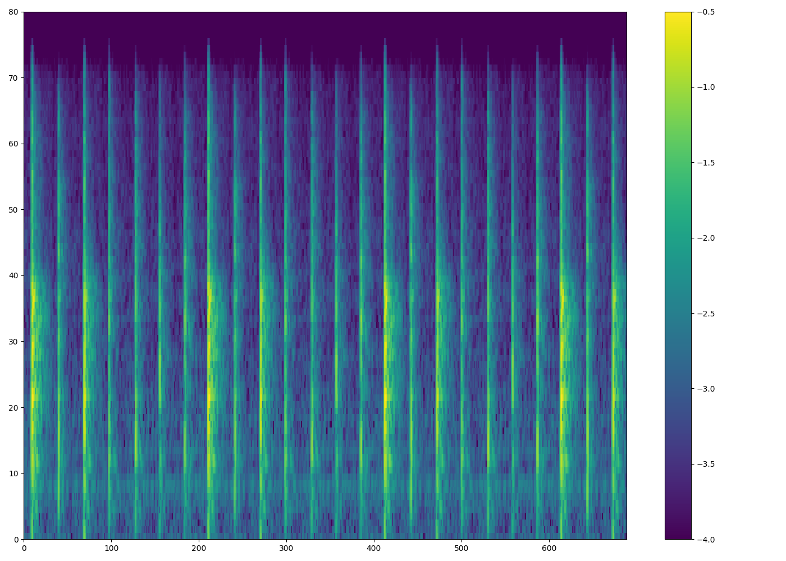
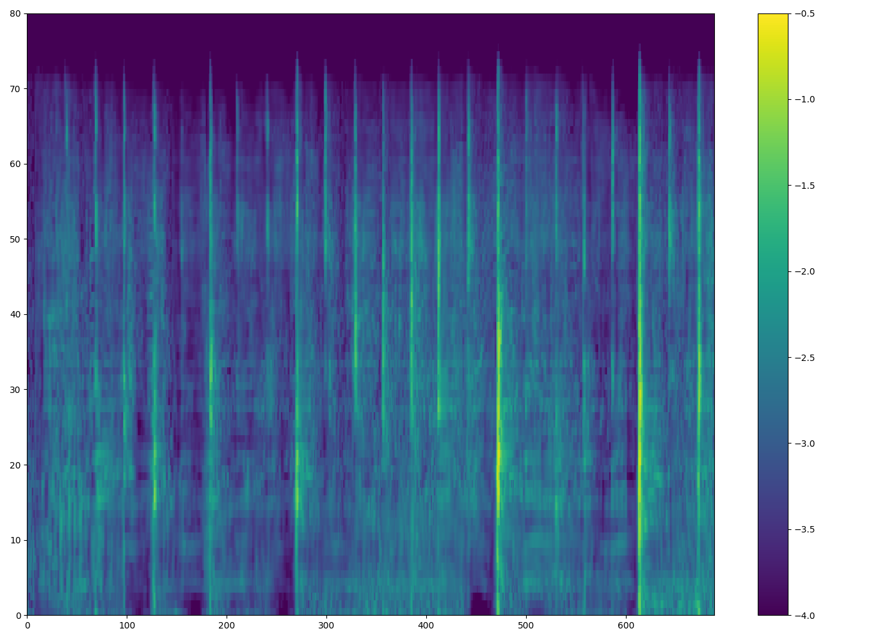
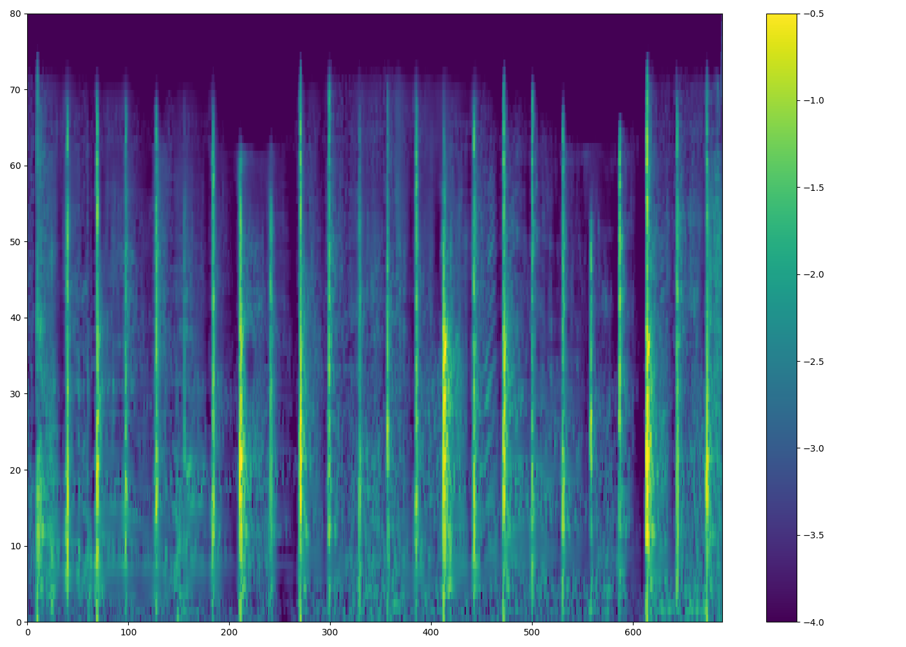

# 
HiFiDenoise: High-FideLity Denoising Text To Speech With Adversarial Networks

## Abstract

 Building a high-fidelity speech synthesis system with noisy speech data is a challenging but valuable task, which could significantly reduce the cost of data collection. Existing methods usually train speech synthesis systems based on the speech denoised with an enhancement model or feed noise information as a condition into the system. These methods certainly have some effect on inhibiting noise, but the quality and the prosody of their synthesized speech are still far away from natural speech. In this paper, we propose HiFiDenoise, a speech synthesis system with adversarial networks that can synthesize high-fidelity speech with low-quality and noisy speech data. Specifically, 1) to tackle the difficulty of noise modeling, we introduce multi-length adversarial training in the noise condition module. 2) To handle the problem of inaccurate pitch extraction caused by noise, we remove the pitch predictor in the acoustic model and also add discriminators on the mel-spectrogram generator. 3) In addition, we also apply HiFiDenoise to singing voice synthesis with a noisy singing dataset. Experiments show that our model outperforms the baseline by 0.36 and 0.44 in terms of MOS on speech and singing respectively.

## Sound Samples

### 1. Speech Synthesis
 
<table style="width: 200px">
  <thead>
    <tr>
      <th style="width: 10px">clean</th>
      <th style="width: 10px">clean(Mel + PWG)</th>
      <th style="width: 10px">noisy</th>
      <th style="width: 10px">enhancement-based</th>
      <th style="width: 10px">DenoiSpeech</th>
      <th style="width: 10px">proposed</th>
    </tr>
  </thead>
  <tbody>
    <tr>
      <td><audio controls="" preload="auto">
            <source src="wavs/VCTK/clean/p253_188.wav"></audio></td>
      <td><audio controls="" preload="auto">
            <source src="wavs/VCTK/clean (mel+pwg)/p253_188.wav"></audio></td>
      <td><audio controls="" preload="auto">
            <source src="wavs/VCTK/noisy/p253_188.wav"></audio></td>
      <td><audio controls="" preload="auto">
            <source src="wavs/VCTK/enhancement/p253_188.wav"></audio></td>
      <td><audio controls="" preload="auto">
            <source src="wavs/VCTK/denoispeech/p253_188.wav"></audio></td>
      <td><audio controls="" preload="auto">
            <source src="wavs/VCTK/proposed/p253_188.wav"></audio></td>
    </tr>

    <tr>
      <td><audio controls="" preload="auto">
            <source src="wavs/VCTK/clean/p253_128.wav"></audio></td>
      <td><audio controls="" preload="auto">
            <source src="wavs/VCTK/clean (mel+pwg)/p253_128.wav"></audio></td>
      <td><audio controls="" preload="auto">
            <source src="wavs/VCTK/noisy/p253_128.wav"></audio></td>
      <td><audio controls="" preload="auto">
            <source src="wavs/VCTK/enhancement/p253_128.wav"></audio></td>
      <td><audio controls="" preload="auto">
            <source src="wavs/VCTK/denoispeech/p253_128.wav"></audio></td>
      <td><audio controls="" preload="auto">
            <source src="wavs/VCTK/proposed/p253_128.wav"></audio></td>
    </tr>

    <tr>
      <td><audio controls="" preload="auto">
            <source src="wavs/VCTK/clean/p253_149.wav"></audio></td>
      <td><audio controls="" preload="auto">
            <source src="wavs/VCTK/clean (mel+pwg)/p253_149.wav"></audio></td>
      <td><audio controls="" preload="auto">
            <source src="wavs/VCTK/noisy/p253_149.wav"></audio></td>
      <td><audio controls="" preload="auto">
            <source src="wavs/VCTK/enhancement/p253_149.wav"></audio></td>
      <td><audio controls="" preload="auto">
            <source src="wavs/VCTK/denoispeech/p253_149.wav"></audio></td>
      <td><audio controls="" preload="auto">
            <source src="wavs/VCTK/proposed/p253_149.wav"></audio></td>
    </tr>

    <tr>
      <td><audio controls="" preload="auto">
            <source src="wavs/VCTK/clean/p253_152.wav"></audio></td>
      <td><audio controls="" preload="auto">
            <source src="wavs/VCTK/clean (mel+pwg)/p253_152.wav"></audio></td>
      <td><audio controls="" preload="auto">
            <source src="wavs/VCTK/noisy/p253_152.wav"></audio></td>
      <td><audio controls="" preload="auto">
            <source src="wavs/VCTK/enhancement/p253_152.wav"></audio></td>
      <td><audio controls="" preload="auto">
            <source src="wavs/VCTK/denoispeech/p253_152.wav"></audio></td>
      <td><audio controls="" preload="auto">
            <source src="wavs/VCTK/proposed/p253_152.wav"></audio></td>
    </tr>

    <tr>
      <td><audio controls="" preload="auto">
            <source src="wavs/VCTK/clean/p253_180.wav"></audio></td>
      <td><audio controls="" preload="auto">
            <source src="wavs/VCTK/clean (mel+pwg)/p253_180.wav"></audio></td>
      <td><audio controls="" preload="auto">
            <source src="wavs/VCTK/noisy/p253_180.wav"></audio></td>
      <td><audio controls="" preload="auto">
            <source src="wavs/VCTK/enhancement/p253_180.wav"></audio></td>
      <td><audio controls="" preload="auto">
            <source src="wavs/VCTK/denoispeech/p253_180.wav"></audio></td>
      <td><audio controls="" preload="auto">
            <source src="wavs/VCTK/proposed/p253_180.wav"></audio></td>
    </tr>

    <tr>
      <td><audio controls="" preload="auto">
            <source src="wavs/VCTK/clean/p254_028.wav"></audio></td>
      <td><audio controls="" preload="auto">
            <source src="wavs/VCTK/clean (mel+pwg)/p254_028.wav"></audio></td>
      <td><audio controls="" preload="auto">
            <source src="wavs/VCTK/noisy/p254_028.wav"></audio></td>
      <td><audio controls="" preload="auto">
            <source src="wavs/VCTK/enhancement/p254_028.wav"></audio></td>
      <td><audio controls="" preload="auto">
            <source src="wavs/VCTK/denoispeech/p254_028.wav"></audio></td>
      <td><audio controls="" preload="auto">
            <source src="wavs/VCTK/proposed/p254_028.wav"></audio></td>
    </tr>

    <tr>
      <td><audio controls="" preload="auto">
            <source src="wavs/VCTK/clean/p254_037.wav"></audio></td>
      <td><audio controls="" preload="auto">
            <source src="wavs/VCTK/clean (mel+pwg)/p254_037.wav"></audio></td>
      <td><audio controls="" preload="auto">
            <source src="wavs/VCTK/noisy/p254_037.wav"></audio></td>
      <td><audio controls="" preload="auto">
            <source src="wavs/VCTK/enhancement/p254_037.wav"></audio></td>
      <td><audio controls="" preload="auto">
            <source src="wavs/VCTK/denoispeech/p254_037.wav"></audio></td>
      <td><audio controls="" preload="auto">
            <source src="wavs/VCTK/proposed/p254_037.wav"></audio></td>
    </tr>

    <tr>
      <td><audio controls="" preload="auto">
            <source src="wavs/VCTK/clean/p254_077.wav"></audio></td>
      <td><audio controls="" preload="auto">
            <source src="wavs/VCTK/clean (mel+pwg)/p254_077.wav"></audio></td>
      <td><audio controls="" preload="auto">
            <source src="wavs/VCTK/noisy/p254_077.wav"></audio></td>
      <td><audio controls="" preload="auto">
            <source src="wavs/VCTK/enhancement/p254_077.wav"></audio></td>
      <td><audio controls="" preload="auto">
            <source src="wavs/VCTK/denoispeech/p254_077.wav"></audio></td>
      <td><audio controls="" preload="auto">
            <source src="wavs/VCTK/proposed/p254_077.wav"></audio></td>
    </tr>

    <tr>
      <td><audio controls="" preload="auto">
            <source src="wavs/VCTK/clean/p254_230.wav"></audio></td>
      <td><audio controls="" preload="auto">
            <source src="wavs/VCTK/clean (mel+pwg)/p254_230.wav"></audio></td>
      <td><audio controls="" preload="auto">
            <source src="wavs/VCTK/noisy/p254_230.wav"></audio></td>
      <td><audio controls="" preload="auto">
            <source src="wavs/VCTK/enhancement/p254_230.wav"></audio></td>
      <td><audio controls="" preload="auto">
            <source src="wavs/VCTK/denoispeech/p254_230.wav"></audio></td>
      <td><audio controls="" preload="auto">
            <source src="wavs/VCTK/proposed/p254_230.wav"></audio></td>
    </tr>

    <tr>
      <td><audio controls="" preload="auto">
            <source src="wavs/VCTK/clean/p254_314.wav"></audio></td>
      <td><audio controls="" preload="auto">
            <source src="wavs/VCTK/clean (mel+pwg)/p254_314.wav"></audio></td>
      <td><audio controls="" preload="auto">
            <source src="wavs/VCTK/noisy/p254_314.wav"></audio></td>
      <td><audio controls="" preload="auto">
            <source src="wavs/VCTK/enhancement/p254_314.wav"></audio></td>
      <td><audio controls="" preload="auto">
            <source src="wavs/VCTK/denoispeech/p254_314.wav"></audio></td>
      <td><audio controls="" preload="auto">
            <source src="wavs/VCTK/proposed/p254_314.wav"></audio></td>
    </tr>
  </tbody>
</table>

 

 
### 2. Singing Voice Synthesis

<table align="center">
  <thead>
    <tr>
      <th>clean</th>
      <th>clean(Mel + PWG)</th>
      <th>noisy</th>
      <th>enhancement-based</th>
      <th>DenoiSpeech</th>
      <th>proposed</th>
    </tr>
  </thead>
  <tbody>
    <tr>
      <td><audio controls="" preload="auto">
            <source src="wavs/OpenSinger/clean/2-6_0037_16.mp3"></audio></td>
      <td><audio controls="" preload="auto">
            <source src="wavs/OpenSinger/clean (mel+pwg)/2-6_0037_16.wav"></audio></td>
      <td><audio controls="" preload="auto">
            <source src="wavs/OpenSinger/noisy/2-6_0037_16.wav"></audio></td>
      <td><audio controls="" preload="auto">
            <source src="wavs/OpenSinger/enhancement/2-6_0037_16.wav"></audio></td>
      <td><audio controls="" preload="auto">
            <source src="wavs/OpenSinger/denoispeech/2-6_0037_16.wav"></audio></td>
      <td><audio controls="" preload="auto">
            <source src="wavs/OpenSinger/proposed/2-6_0037_16.wav"></audio></td>
    </tr>

    <tr>
      <td><audio controls="" preload="auto">
            <source src="wavs/OpenSinger/clean/2-6_0041_29.mp3"></audio></td>
      <td><audio controls="" preload="auto">
            <source src="wavs/OpenSinger/clean (mel+pwg)/2-6_0041_29.wav"></audio></td>
      <td><audio controls="" preload="auto">
            <source src="wavs/OpenSinger/noisy/2-6_0041_29.wav"></audio></td>
      <td><audio controls="" preload="auto">
            <source src="wavs/OpenSinger/enhancement/2-6_0041_29.wav"></audio></td>
      <td><audio controls="" preload="auto">
            <source src="wavs/OpenSinger/denoispeech/2-6_0041_29.wav"></audio></td>
      <td><audio controls="" preload="auto">
            <source src="wavs/OpenSinger/proposed/2-6_0041_29.wav"></audio></td>
    </tr>

    <tr>
      <td><audio controls="" preload="auto">
            <source src="wavs/OpenSinger/clean/2-6_0072_0.mp3"></audio></td>
      <td><audio controls="" preload="auto">
            <source src="wavs/OpenSinger/clean (mel+pwg)/2-6_0072_0.wav"></audio></td>
      <td><audio controls="" preload="auto">
            <source src="wavs/OpenSinger/noisy/2-6_0072_0.wav"></audio></td>
      <td><audio controls="" preload="auto">
            <source src="wavs/OpenSinger/enhancement/2-6_0072_0.wav"></audio></td>
      <td><audio controls="" preload="auto">
            <source src="wavs/OpenSinger/denoispeech/2-6_0072_0.wav"></audio></td>
      <td><audio controls="" preload="auto">
            <source src="wavs/OpenSinger/proposed/2-6_0072_0.wav"></audio></td>
    </tr>

    <tr>
      <td><audio controls="" preload="auto">
            <source src="wavs/OpenSinger/clean/2-6_0157_11.mp3"></audio></td>
      <td><audio controls="" preload="auto">
            <source src="wavs/OpenSinger/clean (mel+pwg)/2-6_0157_11.wav"></audio></td>
      <td><audio controls="" preload="auto">
            <source src="wavs/OpenSinger/noisy/2-6_0157_11.wav"></audio></td>
      <td><audio controls="" preload="auto">
            <source src="wavs/OpenSinger/enhancement/2-6_0157_11.wav"></audio></td>
      <td><audio controls="" preload="auto">
            <source src="wavs/OpenSinger/denoispeech/2-6_0157_11.wav"></audio></td>
      <td><audio controls="" preload="auto">
            <source src="wavs/OpenSinger/proposed/2-6_0157_11.wav"></audio></td>
    </tr>

    <tr>
      <td><audio controls="" preload="auto">
            <source src="wavs/OpenSinger/clean/2-6_0157_15.mp3"></audio></td>
      <td><audio controls="" preload="auto">
            <source src="wavs/OpenSinger/clean (mel+pwg)/2-6_0157_15.wav"></audio></td>
      <td><audio controls="" preload="auto">
            <source src="wavs/OpenSinger/noisy/2-6_0157_15.wav"></audio></td>
      <td><audio controls="" preload="auto">
            <source src="wavs/OpenSinger/enhancement/2-6_0157_15.wav"></audio></td>
      <td><audio controls="" preload="auto">
            <source src="wavs/OpenSinger/denoispeech/2-6_0157_15.wav"></audio></td>
      <td><audio controls="" preload="auto">
            <source src="wavs/OpenSinger/proposed/2-6_0157_15.wav"></audio></td>
    </tr>

    <tr>
      <td><audio controls="" preload="auto">
            <source src="wavs/OpenSinger/clean/2-6_0588_34.mp3"></audio></td>
      <td><audio controls="" preload="auto">
            <source src="wavs/OpenSinger/clean (mel+pwg)/2-6_0588_34.wav"></audio></td>
      <td><audio controls="" preload="auto">
            <source src="wavs/OpenSinger/noisy/2-6_0588_34.wav"></audio></td>
      <td><audio controls="" preload="auto">
            <source src="wavs/OpenSinger/enhancement/2-6_0588_34.wav"></audio></td>
      <td><audio controls="" preload="auto">
            <source src="wavs/OpenSinger/denoispeech/2-6_0588_34.wav"></audio></td>
      <td><audio controls="" preload="auto">
            <source src="wavs/OpenSinger/proposed/2-6_0588_34.wav"></audio></td>
    </tr>

    <tr>
      <td><audio controls="" preload="auto">
            <source src="wavs/OpenSinger/clean/2-6_0760_2.mp3"></audio></td>
      <td><audio controls="" preload="auto">
            <source src="wavs/OpenSinger/clean (mel+pwg)/2-6_0760_2.wav"></audio></td>
      <td><audio controls="" preload="auto">
            <source src="wavs/OpenSinger/noisy/2-6_0760_2.wav"></audio></td>
      <td><audio controls="" preload="auto">
            <source src="wavs/OpenSinger/enhancement/2-6_0760_2.wav"></audio></td>
      <td><audio controls="" preload="auto">
            <source src="wavs/OpenSinger/denoispeech/2-6_0760_2.wav"></audio></td>
      <td><audio controls="" preload="auto">
            <source src="wavs/OpenSinger/proposed/2-6_0760_2.wav"></audio></td>
    </tr>

    <tr>
      <td><audio controls="" preload="auto">
            <source src="wavs/OpenSinger/clean/2-6_0807_21.mp3"></audio></td>
      <td><audio controls="" preload="auto">
            <source src="wavs/OpenSinger/clean (mel+pwg)/2-6_0807_21.wav"></audio></td>
      <td><audio controls="" preload="auto">
            <source src="wavs/OpenSinger/noisy/2-6_0807_21.wav"></audio></td>
      <td><audio controls="" preload="auto">
            <source src="wavs/OpenSinger/enhancement/2-6_0807_21.wav"></audio></td>
      <td><audio controls="" preload="auto">
            <source src="wavs/OpenSinger/denoispeech/2-6_0807_21.wav"></audio></td>
      <td><audio controls="" preload="auto">
            <source src="wavs/OpenSinger/proposed/2-6_0807_21.wav"></audio></td>
    </tr>

    <tr>
      <td><audio controls="" preload="auto">
            <source src="wavs/OpenSinger/clean/2-6_0891_53.mp3"></audio></td>
      <td><audio controls="" preload="auto">
            <source src="wavs/OpenSinger/clean (mel+pwg)/2-6_0891_53.wav"></audio></td>
      <td><audio controls="" preload="auto">
            <source src="wavs/OpenSinger/noisy/2-6_0891_53.wav"></audio></td>
      <td><audio controls="" preload="auto">
            <source src="wavs/OpenSinger/enhancement/2-6_0891_53.wav"></audio></td>
      <td><audio controls="" preload="auto">
            <source src="wavs/OpenSinger/denoispeech/2-6_0891_53.wav"></audio></td>
      <td><audio controls="" preload="auto">
            <source src="wavs/OpenSinger/proposed/2-6_0891_53.wav"></audio></td>
    </tr>

    <tr>
      <td><audio controls="" preload="auto">
            <source src="wavs/OpenSinger/clean/2-6_1059_20.mp3"></audio></td>
      <td><audio controls="" preload="auto">
            <source src="wavs/OpenSinger/clean (mel+pwg)/2-6_1059_20.wav"></audio></td>
      <td><audio controls="" preload="auto">
            <source src="wavs/OpenSinger/noisy/2-6_1059_20.wav"></audio></td>
      <td><audio controls="" preload="auto">
            <source src="wavs/OpenSinger/enhancement/2-6_1059_20.wav"></audio></td>
      <td><audio controls="" preload="auto">
            <source src="wavs/OpenSinger/denoispeech/2-6_1059_20.wav"></audio></td>
      <td><audio controls="" preload="auto">
            <source src="wavs/OpenSinger/proposed/2-6_1059_20.wav"></audio></td>
    </tr>
  </tbody>
</table>

 

## Ablation Studies
 

<table align="center">
  <thead>
    <tr>
      <th>proposed</th>
      <th>- NED</th>
      <th>- MGD</th>
      <th>- NED - MGD (baseline)</th>
    </tr>
  </thead>
  <tbody>
<!--
    <tr>
      <td><audio controls="" preload="auto">
            <source src="wavs/VCTK/proposed/p253_188.wav"></audio></td>
      <td><audio controls="" preload="auto">
            <source src="wavs/VCTK/proposed - noisegan/p253_188.wav"></audio></td>
      <td><audio controls="" preload="auto">
            <source src="wavs/VCTK/proposed - melgan/p253_188.wav"></audio></td>
      <td><audio controls="" preload="auto">
            <source src="wavs/VCTK/denoispeech/p253_188.wav"></audio></td>
    </tr>
-->
    <tr>
      <td><audio controls="" preload="auto">
            <source src="wavs/VCTK/proposed/p253_128.wav"></audio></td>
      <td><audio controls="" preload="auto">
            <source src="wavs/VCTK/proposed - noisegan/p253_128.wav"></audio></td>
      <td><audio controls="" preload="auto">
            <source src="wavs/VCTK/proposed - melgan/p253_128.wav"></audio></td>
      <td><audio controls="" preload="auto">
            <source src="wavs/VCTK/denoispeech/p253_128.wav"></audio></td>
    </tr>
<!--
    <tr>
      <td><audio controls="" preload="auto">
            <source src="wavs/VCTK/proposed/p253_149.wav"></audio></td>
      <td><audio controls="" preload="auto">
            <source src="wavs/VCTK/proposed - noisegan/p253_149.wav"></audio></td>
      <td><audio controls="" preload="auto">
            <source src="wavs/VCTK/proposed - melgan/p253_149.wav"></audio></td>
      <td><audio controls="" preload="auto">
            <source src="wavs/VCTK/denoispeech/p253_149.wav"></audio></td>
    </tr>

    <tr>
      <td><audio controls="" preload="auto">
            <source src="wavs/VCTK/proposed/p253_152.wav"></audio></td>
      <td><audio controls="" preload="auto">
            <source src="wavs/VCTK/proposed - noisegan/p253_152.wav"></audio></td>
      <td><audio controls="" preload="auto">
            <source src="wavs/VCTK/proposed - melgan/p253_152.wav"></audio></td>
      <td><audio controls="" preload="auto">
            <source src="wavs/VCTK/denoispeech/p253_152.wav"></audio></td>
    </tr>
-->
    <tr>
      <td><audio controls="" preload="auto">
            <source src="wavs/VCTK/proposed/p253_180.wav"></audio></td>
      <td><audio controls="" preload="auto">
            <source src="wavs/VCTK/proposed - noisegan/p253_180.wav"></audio></td>
      <td><audio controls="" preload="auto">
            <source src="wavs/VCTK/proposed - melgan/p253_180.wav"></audio></td>
      <td><audio controls="" preload="auto">
            <source src="wavs/VCTK/denoispeech/p253_180.wav"></audio></td>
    </tr>
<!--
    <tr>
      <td><audio controls="" preload="auto">
            <source src="wavs/VCTK/proposed/p254_028.wav"></audio></td>
      <td><audio controls="" preload="auto">
            <source src="wavs/VCTK/proposed - noisegan/p254_028.wav"></audio></td>
      <td><audio controls="" preload="auto">
            <source src="wavs/VCTK/proposed - melgan/p254_028.wav"></audio></td>
      <td><audio controls="" preload="auto">
            <source src="wavs/VCTK/denoispeech/p254_028.wav"></audio></td>
    </tr>
-->
    <tr>
      <td><audio controls="" preload="auto">
            <source src="wavs/VCTK/proposed/p254_037.wav"></audio></td>
      <td><audio controls="" preload="auto">
            <source src="wavs/VCTK/proposed - noisegan/p254_037.wav"></audio></td>
      <td><audio controls="" preload="auto">
            <source src="wavs/VCTK/proposed - melgan/p254_037.wav"></audio></td>
      <td><audio controls="" preload="auto">
            <source src="wavs/VCTK/denoispeech/p254_037.wav"></audio></td>
    </tr>

    <tr>
      <td><audio controls="" preload="auto">
            <source src="wavs/VCTK/proposed/p254_077.wav"></audio></td>
      <td><audio controls="" preload="auto">
            <source src="wavs/VCTK/proposed - noisegan/p254_077.wav"></audio></td>
      <td><audio controls="" preload="auto">
            <source src="wavs/VCTK/proposed - melgan/p254_077.wav"></audio></td>
      <td><audio controls="" preload="auto">
            <source src="wavs/VCTK/denoispeech/p254_077.wav"></audio></td>
    </tr>
<!--
    <tr>
      <td><audio controls="" preload="auto">
            <source src="wavs/VCTK/proposed/p254_230.wav"></audio></td>
      <td><audio controls="" preload="auto">
            <source src="wavs/VCTK/proposed - noisegan/p254_230.wav"></audio></td>
      <td><audio controls="" preload="auto">
            <source src="wavs/VCTK/proposed - melgan/p254_230.wav"></audio></td>
      <td><audio controls="" preload="auto">
            <source src="wavs/VCTK/denoispeech/p254_230.wav"></audio></td>
    </tr>

    <tr>
      <td><audio controls="" preload="auto">
            <source src="wavs/VCTK/proposed/p254_314.wav"></audio></td>
      <td><audio controls="" preload="auto">
            <source src="wavs/VCTK/proposed - noisegan/p254_314.wav"></audio></td>
      <td><audio controls="" preload="auto">
            <source src="wavs/VCTK/proposed - melgan/p254_314.wav"></audio></td>
      <td><audio controls="" preload="auto">
            <source src="wavs/VCTK/denoispeech/p254_314.wav"></audio></td>
    </tr>
-->
  </tbody>
</table>

 

## Visualization of Extracted Noise
 

<table align="center">
 <thead>
    <tr>
      <th>GT Noise</th>
      <th>Without NED</th>
      <th>With NED</th>
    </tr>
  </thead>
  <tbody>
    <tr>
      <td><audio controls="" preload="auto">
            <source src="wavs/noise/2-6_0089_12G.wav"></audio></td>
      <td><audio controls="" preload="auto">
            <source src="wavs/noise/2-6_0089_12B.wav"></audio></td>
      <td><audio controls="" preload="auto">
            <source src="wavs/noise/2-6_0089_12D.wav"></audio></td>
    </tr>

    <tr>
      <td></td>
      <td></td>
      <td></td>
    </tr>

    <tr>
      <td><audio controls="" preload="auto">
            <source src="wavs/noise/2-6_0157_15G.wav"></audio></td>
      <td><audio controls="" preload="auto">
            <source src="wavs/noise/2-6_0157_15B.wav"></audio></td>
      <td><audio controls="" preload="auto">
            <source src="wavs/noise/2-6_0157_15D.wav"></audio></td>
    </tr>

    <tr>
      <td></td>
      <td></td>
      <td></td>
    </tr>
  </tbody>
</table>

 
